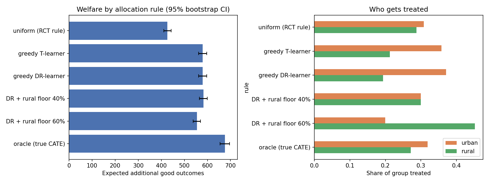
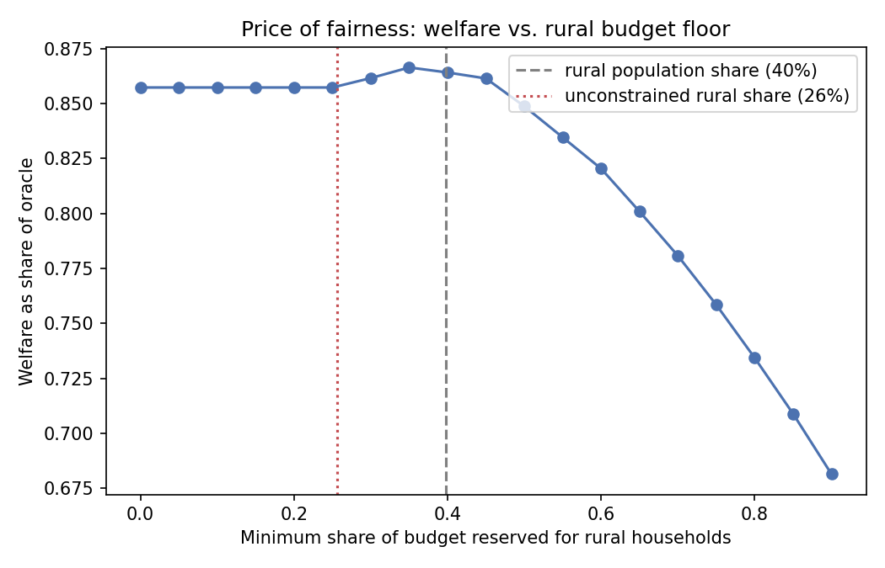

# fairtarget

Budget-constrained intervention targeting with fairness floors, from heterogeneous-treatment-effect estimates.

A programme ran a randomised trial. It can now only afford to treat a fraction of the population. This package answers two questions a programme manager actually has:

1. **Who should get it?** Rank on estimated conditional treatment effects (CATE) and treat the top-k, instead of the trial's uniform assignment.
2. **What does equity cost?** Impose minimum budget shares per group (e.g. rural households) as linear constraints and measure the welfare lost, or gained, relative to unconstrained targeting.

Because the demo population has a *known* CATE, every rule is scored against the oracle and the loss is decomposed into **estimation error** and **price of fairness**.

## Quick start

```bash
pip install -r requirements.txt
python run_experiment.py            # writes figures/ and prints the summary table
python -m pytest tests              # 9 tests, ~3 s
jupyter notebook demo.ipynb         # narrated walkthrough
```

## Headline result (n = 10 000, budget = 30 %, seed 0)

| rule | expected additional outcomes | share of oracle | rural coverage |
|---|---:|---:|---:|
| uniform (RCT rule) | 427 | 0.63 | 0.29 |
| greedy on DR-learner CATE | 579 | 0.86 | 0.19 |
| DR + proportional rural floor (40 %) | 583 | 0.86 | 0.30 |
| DR + rural floor 60 % | 554 | 0.82 | 0.45 |
| oracle (true CATE) | 676 | 1.00 | 0.27 |

Targeting lifts outcomes ~36 % over uniform assignment. The **proportional** rural floor is essentially free (+0.6 %), because the CATE estimators under-shoot rural effects and the constraint pulls the allocation back toward what a perfect estimator would do. Fairness and efficiency are not always in tension; the price only becomes material once floors exceed what the true effects justify.




## Package layout

```
fairtarget/
  simulate.py   population with known CATE; draw_trial() yields an RCT
  estimate.py   TLearner, DRLearner (cross-fitted, sklearn only), crossfit_cate()
  allocate.py   uniform(), greedy(), fair_floor()  [LP with integral relaxation]
  evaluate.py   welfare, coverage, benefit share, bootstrap CIs, summarise()
run_experiment.py   end-to-end run, writes figures/
demo.ipynb          executed notebook
tests/              pytest suite
```

## Method notes

* **CATE estimation.** T-learner and doubly-robust learner (Kennedy 2020) with K-fold cross-fitting; allocation always uses out-of-fold predictions so ranking is never on in-sample fits.
* **Allocation.** `fair_floor` solves max Σ sᵢaᵢ s.t. Σaᵢ ≤ k and Σ_{i∈g} aᵢ ≥ floor_g·k. One budget row plus group rows that partition the units gives a totally unimodular matrix, so `scipy.optimize.linprog` returns a 0/1 solution without integer programming.
* **Evaluation.** Welfare = Σ true CATE over the treated set (expected extra good outcomes). Bootstrap CIs over individuals.

## What this is not (yet)

Synthetic data only; one protected attribute; single-round decision; two-stage predict-then-optimise rather than decision-focused learning.
